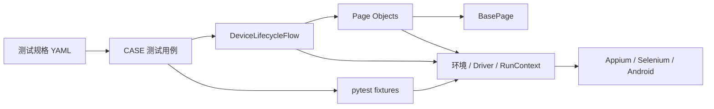

# Python 代码调用关系图

> 本文档由 `.agents/skills/code-callgraph/scripts/generate_callgraph.py` 基于 Python AST 生成。
> 图中只包含可静态解析的项目内部调用和 pytest fixture 注入；动态反射、字符串调用及第三方库内部调用不在图中。

## 项目分层总览

## CASE00 调用图

```mermaid
flowchart TD
    nc8c9a7214b["CASE00<br/>test_case00_enter_device_details_and_view_information()"]
    ndfc47c5362["_log_tail()"]
    n642bbe7fa5["_resolve_appium_command()"]
    n15f2a57bf5["_server_is_ready()"]
    n35e95e4ac5["_stop_process()"]
    n41acecdda5["fixture<br/>appium_server_url()"]
    nb40f747321["fixture<br/>driver()"]
    n88acc3da65["fixture<br/>environment()"]
    n9e4cda08cf["fixture<br/>run_context()"]
    nf188c3dd1a["create_android_driver()"]
    n0028de1ebe["_merge()"]
    n9d3343ae95["_read_yaml()"]
    nce24bff7ef["_required()"]
    n775f45e09e["load_environment()"]
    n7be11158d6["RunContext._save_failure()"]
    n9da65318db["RunContext.create()"]
    n1f2a03d290["RunContext.save_evidence()"]
    ncce215c57f["RunContext.step()"]
    n3c2c78bf99["DeviceLifecycleFlow.__init__()"]
    n9f67e9c229["DeviceLifecycleFlow.activate_and_return_home()"]
    ne902baa514["DeviceLifecycleFlow.open_device_details()"]
    n3758f668c8["BasePage.__init__()"]
    n9d6c662586["BasePage.back()"]
    n2782ff87e5["BasePage.find_texts()"]
    n6bd51eb778["BasePage.text_selector()"]
    n001f32db6f["BasePage.wait_for_text()"]
    nd3182dead1["DevicePanelPage.assert_details()"]
    nfd37ff7ace["DevicePanelPage.open_settings()"]
    nff025f2dce["DeviceSettingsPage.assert_loaded()"]
    n3dfa8d3dcb["HomePage.find_device()"]
    n42d8b59b31["HomePage.return_to_home()"]
    naa35a42260["HomePage.select_common_devices()"]
    nc8c9a7214b -->|fixture| nb40f747321
    nc8c9a7214b -->|fixture| n88acc3da65
    nc8c9a7214b -->|fixture| n9e4cda08cf
    nc8c9a7214b --> n1f2a03d290
    nc8c9a7214b --> ncce215c57f
    nc8c9a7214b --> n3c2c78bf99
    nc8c9a7214b --> n9f67e9c229
    nc8c9a7214b --> ne902baa514
    nc8c9a7214b --> n9d6c662586
    nc8c9a7214b --> nd3182dead1
    nc8c9a7214b --> nfd37ff7ace
    nc8c9a7214b --> nff025f2dce
    nc8c9a7214b --> n3dfa8d3dcb
    n41acecdda5 --> ndfc47c5362
    n41acecdda5 --> n642bbe7fa5
    n41acecdda5 --> n15f2a57bf5
    n41acecdda5 --> n35e95e4ac5
    nb40f747321 -->|fixture| n41acecdda5
    nb40f747321 -->|fixture| n88acc3da65
    nb40f747321 --> nf188c3dd1a
    n88acc3da65 --> n775f45e09e
    n9e4cda08cf --> n9da65318db
    n775f45e09e --> n0028de1ebe
    n775f45e09e --> n9d3343ae95
    n775f45e09e --> nce24bff7ef
    n7be11158d6 --> n1f2a03d290
    ncce215c57f --> n7be11158d6
    n3c2c78bf99 --> n3758f668c8
    n9f67e9c229 --> n42d8b59b31
    ne902baa514 --> nd3182dead1
    ne902baa514 --> n3dfa8d3dcb
    n2782ff87e5 --> n6bd51eb778
    n001f32db6f --> n6bd51eb778
    nd3182dead1 --> n001f32db6f
    nff025f2dce --> n001f32db6f
    n3dfa8d3dcb --> naa35a42260
    naa35a42260 --> n2782ff87e5
```

## CASE01 调用图

```mermaid
flowchart TD
    n26094f855f["CASE01<br/>test_case01_remove_device_successfully()"]
    ndfc47c5362["_log_tail()"]
    n642bbe7fa5["_resolve_appium_command()"]
    n15f2a57bf5["_server_is_ready()"]
    n35e95e4ac5["_stop_process()"]
    n41acecdda5["fixture<br/>appium_server_url()"]
    nb40f747321["fixture<br/>driver()"]
    n88acc3da65["fixture<br/>environment()"]
    n9e4cda08cf["fixture<br/>run_context()"]
    nf188c3dd1a["create_android_driver()"]
    n0028de1ebe["_merge()"]
    n9d3343ae95["_read_yaml()"]
    nce24bff7ef["_required()"]
    n775f45e09e["load_environment()"]
    n7be11158d6["RunContext._save_failure()"]
    n9da65318db["RunContext.create()"]
    n1f2a03d290["RunContext.save_evidence()"]
    ncce215c57f["RunContext.step()"]
    n3c2c78bf99["DeviceLifecycleFlow.__init__()"]
    n9f67e9c229["DeviceLifecycleFlow.activate_and_return_home()"]
    ne902baa514["DeviceLifecycleFlow.open_device_details()"]
    n87b3d19877["DeviceLifecycleFlow.open_device_settings()"]
    n8ee8759231["DeviceLifecycleFlow.unbind_device()"]
    n3758f668c8["BasePage.__init__()"]
    n2782ff87e5["BasePage.find_texts()"]
    n6bd51eb778["BasePage.text_selector()"]
    n001f32db6f["BasePage.wait_for_text()"]
    nd3182dead1["DevicePanelPage.assert_details()"]
    nfd37ff7ace["DevicePanelPage.open_settings()"]
    nff025f2dce["DeviceSettingsPage.assert_loaded()"]
    nad9c75e98d["DeviceSettingsPage.unbind()"]
    n68daa3064d["DeviceSettingsPage.wait_until_home()"]
    n880a354a8d["HomePage.assert_device_absent()"]
    n3dfa8d3dcb["HomePage.find_device()"]
    n42d8b59b31["HomePage.return_to_home()"]
    naa35a42260["HomePage.select_common_devices()"]
    n26094f855f -->|fixture| nb40f747321
    n26094f855f -->|fixture| n88acc3da65
    n26094f855f -->|fixture| n9e4cda08cf
    n26094f855f --> n1f2a03d290
    n26094f855f --> ncce215c57f
    n26094f855f --> n3c2c78bf99
    n26094f855f --> n9f67e9c229
    n26094f855f --> n8ee8759231
    n41acecdda5 --> ndfc47c5362
    n41acecdda5 --> n642bbe7fa5
    n41acecdda5 --> n15f2a57bf5
    n41acecdda5 --> n35e95e4ac5
    nb40f747321 -->|fixture| n41acecdda5
    nb40f747321 -->|fixture| n88acc3da65
    nb40f747321 --> nf188c3dd1a
    n88acc3da65 --> n775f45e09e
    n9e4cda08cf --> n9da65318db
    n775f45e09e --> n0028de1ebe
    n775f45e09e --> n9d3343ae95
    n775f45e09e --> nce24bff7ef
    n7be11158d6 --> n1f2a03d290
    ncce215c57f --> n7be11158d6
    n3c2c78bf99 --> n3758f668c8
    n9f67e9c229 --> n42d8b59b31
    ne902baa514 --> nd3182dead1
    ne902baa514 --> n3dfa8d3dcb
    n87b3d19877 --> ne902baa514
    n87b3d19877 --> nfd37ff7ace
    n87b3d19877 --> nff025f2dce
    n8ee8759231 --> n87b3d19877
    n8ee8759231 --> nad9c75e98d
    n8ee8759231 --> n68daa3064d
    n8ee8759231 --> n880a354a8d
    n2782ff87e5 --> n6bd51eb778
    n001f32db6f --> n6bd51eb778
    nd3182dead1 --> n001f32db6f
    nff025f2dce --> n001f32db6f
    nad9c75e98d --> n001f32db6f
    n880a354a8d --> naa35a42260
    n3dfa8d3dcb --> naa35a42260
    naa35a42260 --> n2782ff87e5
```

## CASE02 调用图

```mermaid
flowchart TD
    n20f7559175["CASE02<br/>test_case02_remove_and_repair_device_successfully()"]
    ndfc47c5362["_log_tail()"]
    n642bbe7fa5["_resolve_appium_command()"]
    n15f2a57bf5["_server_is_ready()"]
    n35e95e4ac5["_stop_process()"]
    n41acecdda5["fixture<br/>appium_server_url()"]
    nb40f747321["fixture<br/>driver()"]
    n88acc3da65["fixture<br/>environment()"]
    n9e4cda08cf["fixture<br/>run_context()"]
    nf188c3dd1a["create_android_driver()"]
    n0028de1ebe["_merge()"]
    n9d3343ae95["_read_yaml()"]
    nce24bff7ef["_required()"]
    n775f45e09e["load_environment()"]
    n7be11158d6["RunContext._save_failure()"]
    n9da65318db["RunContext.create()"]
    n1f2a03d290["RunContext.save_evidence()"]
    ncce215c57f["RunContext.step()"]
    n3c2c78bf99["DeviceLifecycleFlow.__init__()"]
    n9f67e9c229["DeviceLifecycleFlow.activate_and_return_home()"]
    n9f87138c6f["DeviceLifecycleFlow.open_add_device()"]
    ne902baa514["DeviceLifecycleFlow.open_device_details()"]
    n87b3d19877["DeviceLifecycleFlow.open_device_settings()"]
    n324b184102["DeviceLifecycleFlow.submit_default_wifi()"]
    n8ee8759231["DeviceLifecycleFlow.unbind_device()"]
    n57d51b306c["DeviceLifecycleFlow.wait_for_pairing_success()"]
    n24e521aa42["AddDevicePage.continue_from_detected_device()"]
    n6123a3eb38["AddDevicePage.submit_default_wifi()"]
    n0e30d019ab["AddDevicePage.wait_for_pairing_success()"]
    n9605afa387["AddDevicePage.wait_until_loaded()"]
    n3758f668c8["BasePage.__init__()"]
    n2782ff87e5["BasePage.find_texts()"]
    na54ddc0d3f["BasePage.resource_id()"]
    n6bd51eb778["BasePage.text_selector()"]
    n001f32db6f["BasePage.wait_for_text()"]
    nd3182dead1["DevicePanelPage.assert_details()"]
    nfd37ff7ace["DevicePanelPage.open_settings()"]
    nff025f2dce["DeviceSettingsPage.assert_loaded()"]
    nad9c75e98d["DeviceSettingsPage.unbind()"]
    n68daa3064d["DeviceSettingsPage.wait_until_home()"]
    n880a354a8d["HomePage.assert_device_absent()"]
    n3dfa8d3dcb["HomePage.find_device()"]
    n55ae38685f["HomePage.open_add_device_page()"]
    n42d8b59b31["HomePage.return_to_home()"]
    naa35a42260["HomePage.select_common_devices()"]
    n20f7559175 -->|fixture| nb40f747321
    n20f7559175 -->|fixture| n88acc3da65
    n20f7559175 -->|fixture| n9e4cda08cf
    n20f7559175 --> n1f2a03d290
    n20f7559175 --> ncce215c57f
    n20f7559175 --> n3c2c78bf99
    n20f7559175 --> n9f67e9c229
    n20f7559175 --> n9f87138c6f
    n20f7559175 --> n324b184102
    n20f7559175 --> n8ee8759231
    n20f7559175 --> n57d51b306c
    n41acecdda5 --> ndfc47c5362
    n41acecdda5 --> n642bbe7fa5
    n41acecdda5 --> n15f2a57bf5
    n41acecdda5 --> n35e95e4ac5
    nb40f747321 -->|fixture| n41acecdda5
    nb40f747321 -->|fixture| n88acc3da65
    nb40f747321 --> nf188c3dd1a
    n88acc3da65 --> n775f45e09e
    n9e4cda08cf --> n9da65318db
    n775f45e09e --> n0028de1ebe
    n775f45e09e --> n9d3343ae95
    n775f45e09e --> nce24bff7ef
    n7be11158d6 --> n1f2a03d290
    ncce215c57f --> n7be11158d6
    n3c2c78bf99 --> n3758f668c8
    n9f67e9c229 --> n42d8b59b31
    n9f87138c6f --> n9605afa387
    n9f87138c6f --> n55ae38685f
    ne902baa514 --> nd3182dead1
    ne902baa514 --> n3dfa8d3dcb
    n87b3d19877 --> ne902baa514
    n87b3d19877 --> nfd37ff7ace
    n87b3d19877 --> nff025f2dce
    n324b184102 --> n24e521aa42
    n324b184102 --> n6123a3eb38
    n8ee8759231 --> n87b3d19877
    n8ee8759231 --> nad9c75e98d
    n8ee8759231 --> n68daa3064d
    n8ee8759231 --> n880a354a8d
    n57d51b306c --> n0e30d019ab
    n57d51b306c --> nd3182dead1
    n24e521aa42 --> n6bd51eb778
    n24e521aa42 --> n001f32db6f
    n6123a3eb38 --> na54ddc0d3f
    n0e30d019ab --> na54ddc0d3f
    n0e30d019ab --> n001f32db6f
    n9605afa387 --> n001f32db6f
    n2782ff87e5 --> n6bd51eb778
    n001f32db6f --> n6bd51eb778
    nd3182dead1 --> n001f32db6f
    nff025f2dce --> n001f32db6f
    nad9c75e98d --> n001f32db6f
    n880a354a8d --> naa35a42260
    n3dfa8d3dcb --> naa35a42260
    n55ae38685f --> na54ddc0d3f
    naa35a42260 --> n2782ff87e5
```

## CASE 直接共享调用

```mermaid
flowchart TD
    nc8c9a7214b["CASE00<br/>test_case00_enter_device_details_and_view_information()"]
    n26094f855f["CASE01<br/>test_case01_remove_device_successfully()"]
    n20f7559175["CASE02<br/>test_case02_remove_and_repair_device_successfully()"]
    nb40f747321["fixture<br/>driver()"]
    n88acc3da65["fixture<br/>environment()"]
    n9e4cda08cf["fixture<br/>run_context()"]
    n1f2a03d290["RunContext.save_evidence()"]
    ncce215c57f["RunContext.step()"]
    n3c2c78bf99["DeviceLifecycleFlow.__init__()"]
    n9f67e9c229["DeviceLifecycleFlow.activate_and_return_home()"]
    n8ee8759231["DeviceLifecycleFlow.unbind_device()"]
    nc8c9a7214b -->|fixture| nb40f747321
    nc8c9a7214b -->|fixture| n88acc3da65
    nc8c9a7214b -->|fixture| n9e4cda08cf
    nc8c9a7214b --> n1f2a03d290
    nc8c9a7214b --> ncce215c57f
    nc8c9a7214b --> n3c2c78bf99
    nc8c9a7214b --> n9f67e9c229
    n26094f855f -->|fixture| nb40f747321
    n26094f855f -->|fixture| n88acc3da65
    n26094f855f -->|fixture| n9e4cda08cf
    n26094f855f --> n1f2a03d290
    n26094f855f --> ncce215c57f
    n26094f855f --> n3c2c78bf99
    n26094f855f --> n9f67e9c229
    n26094f855f --> n8ee8759231
    n20f7559175 -->|fixture| nb40f747321
    n20f7559175 -->|fixture| n88acc3da65
    n20f7559175 -->|fixture| n9e4cda08cf
    n20f7559175 --> n1f2a03d290
    n20f7559175 --> ncce215c57f
    n20f7559175 --> n3c2c78bf99
    n20f7559175 --> n9f67e9c229
    n20f7559175 --> n8ee8759231
```

## 函数索引

| 层级 | 函数或方法 | 功能说明 | 定义位置 | 项目内调用者数 | 项目内调用数 |
| --- | --- | --- | --- | ---: | ---: |
| Core | `create_android_driver()` | 根据环境配置创建保持 App 数据不变的 Android Appium Session。 | `appium_auto/core/driver_factory.py:7` | 1 | 0 |
| Core | `WifiConfig.__repr__()` | 返回隐藏密码的调试文本，防止凭据进入日志和异常信息。 | `appium_auto/core/environment.py:52` | 0 | 0 |
| Core | `_read_yaml()` | 读取 YAML 配置并将文件、语法和顶层类型错误转换为可操作提示。 | `appium_auto/core/environment.py:68` | 2 | 0 |
| Core | `_merge()` | 递归合并配置映射，使局部文件只需声明需要覆盖的字段。 | `appium_auto/core/environment.py:82` | 1 | 0 |
| Core | `_required()` | 读取并校验必填字符串字段，返回去除首尾空白后的值。 | `appium_auto/core/environment.py:95` | 2 | 0 |
| Core | `load_wifi_config()` | 按显式路径或 WIFI_CONFIG_FILE 加载可选的本地 Wi-Fi 凭据。 | `appium_auto/core/environment.py:104` | 2 | 2 |
| Core | `load_environment()` | 按默认值、本地文件、环境变量的顺序加载运行环境。 | `appium_auto/core/environment.py:118` | 5 | 3 |
| Core | `RunContext.create()` | 为指定用例创建唯一运行目录和独立文件日志器。 | `appium_auto/core/run_context.py:20` | 2 | 0 |
| Core | `RunContext.save_evidence()` | 保存当前页面截图和 Page Source，供失败复盘或结果留证。 | `appium_auto/core/run_context.py:36` | 4 | 0 |
| Core | `RunContext._save_failure()` | 记录失败步骤、异常和可选 UI 证据，且不覆盖原始异常。 | `appium_auto/core/run_context.py:44` | 1 | 1 |
| Core | `RunContext.step()` | 包裹一个业务步骤，并在异常时自动保存步骤上下文后原样抛出。 | `appium_auto/core/run_context.py:83` | 3 | 1 |
| Fixture | `_server_is_ready()` | 调用 Appium 状态接口，判断 Server 是否已经可以建立 Session。 | `appium_auto/conftest.py:21` | 1 | 0 |
| Fixture | `_resolve_appium_command()` | 解析当前平台可执行的 Appium 启动命令，并在缺失依赖时终止测试。 | `appium_auto/conftest.py:32` | 1 | 0 |
| Fixture | `_stop_process()` | 先温和终止 fixture 启动的进程，超时后再强制结束。 | `appium_auto/conftest.py:52` | 1 | 0 |
| Fixture | `_log_tail()` | 读取 Appium 日志末尾片段，用于启动失败提示。 | `appium_auto/conftest.py:65` | 1 | 0 |
| Fixture | `appium_server_url()` | 复用现有 Appium Server，或为本次 pytest 会话启动并关闭本机服务。 | `appium_auto/conftest.py:75` | 1 | 4 |
| Fixture | `environment()` | 在一次 pytest 会话中只加载一次分层环境配置。 | `appium_auto/conftest.py:146` | 4 | 1 |
| Fixture | `driver()` | 为每条用例创建独立 Appium Session，并在用例结束后关闭 Session。 | `appium_auto/conftest.py:153` | 3 | 3 |
| Fixture | `run_context()` | 根据 case_id 标记创建当前用例的日志和诊断上下文。 | `appium_auto/conftest.py:162` | 3 | 1 |
| Flow | `DeviceLifecycleFlow.__init__()` | 使用同一 Driver 和环境构建设备生命周期所需页面对象。 | `appium_auto/flows/device_lifecycle.py:16` | 3 | 1 |
| Flow | `DeviceLifecycleFlow.activate_and_return_home()` | 激活目标 App，等待 package 正确后恢复到设备首页。 | `appium_auto/flows/device_lifecycle.py:28` | 3 | 1 |
| Flow | `DeviceLifecycleFlow.open_device_details()` | 在首页查找目标设备，进入并验证设备详情页。 | `appium_auto/flows/device_lifecycle.py:37` | 2 | 2 |
| Flow | `DeviceLifecycleFlow.open_device_settings()` | 从首页进入目标设备详情，再打开并验证高级设置页。 | `appium_auto/flows/device_lifecycle.py:43` | 1 | 3 |
| Flow | `DeviceLifecycleFlow.unbind_device()` | 解除目标设备绑定，并验证解绑后首页已不存在该设备。 | `appium_auto/flows/device_lifecycle.py:50` | 2 | 4 |
| Flow | `DeviceLifecycleFlow.open_add_device()` | 从首页进入添加设备页面并确认页面加载完成。 | `appium_auto/flows/device_lifecycle.py:58` | 1 | 2 |
| Flow | `DeviceLifecycleFlow.submit_default_wifi()` | 选择自动发现的设备并提交 App 默认显示的 Wi-Fi 信息。 | `appium_auto/flows/device_lifecycle.py:64` | 1 | 2 |
| Flow | `DeviceLifecycleFlow.wait_for_pairing_success()` | 等待配网成功、点击完成，并验证最终进入设备详情页。 | `appium_auto/flows/device_lifecycle.py:70` | 1 | 2 |
| Page | `AddDevicePage.wait_until_loaded()` | 等待添加设备页面标题出现。 | `appium_auto/pages/add_device_page.py:14` | 1 | 1 |
| Page | `AddDevicePage.continue_from_detected_device()` | 兼容发现页或已进入 Wi-Fi 页两种状态，并推进到 Wi-Fi 信息页。 | `appium_auto/pages/add_device_page.py:19` | 1 | 2 |
| Page | `AddDevicePage.submit_default_wifi()` | 提交 App 已填充的默认 Wi-Fi 信息，并等待离开敏感信息页面。 | `appium_auto/pages/add_device_page.py:45` | 1 | 1 |
| Page | `AddDevicePage.wait_for_pairing_success()` | 严格确认“正在添加”后等待成功状态，并返回完成按钮。 | `appium_auto/pages/add_device_page.py:57` | 2 | 2 |
| Page | `BasePage.__init__()` | 保存 Appium Driver 和当前运行环境，供具体页面对象复用。 | `appium_auto/pages/base_page.py:11` | 6 | 0 |
| Page | `BasePage.resource_id()` | 使用环境中的 App package 拼接完整 Android resource-id。 | `appium_auto/pages/base_page.py:19` | 7 | 0 |
| Page | `BasePage.text_selector()` | 生成按完整文本匹配的 UiAutomator2 selector。 | `appium_auto/pages/base_page.py:25` | 3 | 0 |
| Page | `BasePage.wait_for_text()` | 显式等待指定文本元素出现并返回元素对象。 | `appium_auto/pages/base_page.py:30` | 6 | 1 |
| Page | `BasePage.find_texts()` | 立即查找所有匹配文本的元素，不因元素不存在而抛出异常。 | `appium_auto/pages/base_page.py:39` | 1 | 1 |
| Page | `BasePage.back()` | 执行一次 Android 系统返回操作。 | `appium_auto/pages/base_page.py:46` | 1 | 0 |
| Page | `DevicePanelPage.assert_details()` | 断言详情页同时显示目标设备名称、温度和湿度。 | `appium_auto/pages/device_panel_page.py:15` | 3 | 1 |
| Page | `DevicePanelPage.open_settings()` | 等待并点击设备详情页右上角的设置按钮。 | `appium_auto/pages/device_panel_page.py:22` | 2 | 0 |
| Page | `DeviceSettingsPage.assert_loaded()` | 通过“移除设备”入口确认高级设置页已经加载。 | `appium_auto/pages/device_settings_page.py:10` | 2 | 1 |
| Page | `DeviceSettingsPage.unbind()` | 依次完成移除设备、解除绑定和最终确认操作。 | `appium_auto/pages/device_settings_page.py:15` | 1 | 1 |
| Page | `DeviceSettingsPage.wait_until_home()` | 等待解绑完成后 App 自动返回设备首页。 | `appium_auto/pages/device_settings_page.py:26` | 1 | 0 |
| Page | `HomePage.home_menu_xpath()` | 返回首页右上角更多菜单按钮的 XPath。 | `appium_auto/pages/home_page.py:12` | 0 | 1 |
| Page | `HomePage.home_tab_selector()` | 返回用于确认首页标签已选中的 UiAutomator2 selector。 | `appium_auto/pages/home_page.py:21` | 0 | 1 |
| Page | `HomePage.device_selector()` | 返回按环境设备名称定位设备卡片的 selector。 | `appium_auto/pages/home_page.py:30` | 0 | 1 |
| Page | `HomePage.scroll_to_device_selector()` | 返回在设备列表中向下滚动查找目标设备的 selector。 | `appium_auto/pages/home_page.py:40` | 0 | 1 |
| Page | `HomePage.wait_until_loaded()` | 等待首页标签进入选中状态，确认设备列表已加载。 | `appium_auto/pages/home_page.py:52` | 0 | 0 |
| Page | `HomePage.return_to_home()` | 最多执行三次返回，将 App 内任意常见页面恢复到设备首页。 | `appium_auto/pages/home_page.py:61` | 1 | 0 |
| Page | `HomePage.select_common_devices()` | 存在“常用”标签时切换到该标签，统一后续设备查找范围。 | `appium_auto/pages/home_page.py:81` | 2 | 1 |
| Page | `HomePage.find_device()` | 先检查当前可见区域，再滚动设备列表并返回目标设备元素。 | `appium_auto/pages/home_page.py:88` | 2 | 1 |
| Page | `HomePage.assert_device_absent()` | 检查当前区域和完整可滚动列表，断言目标设备确实不存在。 | `appium_auto/pages/home_page.py:107` | 3 | 1 |
| Page | `HomePage.open_add_device_page()` | 打开右上角菜单并进入添加设备页，结束时恢复多窗口设置。 | `appium_auto/pages/home_page.py:132` | 2 | 1 |
| 单元测试 | `test_pairing_success_strictly_waits_for_adding_before_success()` | 验证配网页严格先断言“正在添加”，再等待“添加成功”。 | `tests/unit/test_add_device_page.py:7` | 0 | 3 |
| 单元测试 | `_python_files()` | 返回需要执行中文函数说明门禁的项目 Python 文件。 | `tests/unit/test_code_documentation.py:15` | 1 | 0 |
| 单元测试 | `_missing_chinese_docstrings()` | 收集指定文件中缺少中文 docstring 的函数和方法位置。 | `tests/unit/test_code_documentation.py:28` | 1 | 0 |
| 单元测试 | `test_all_python_functions_have_chinese_docstrings()` | 确保现有及后续生成的 Python 函数都提供中文职责说明。 | `tests/unit/test_code_documentation.py:43` | 0 | 2 |
| 单元测试 | `_flow_without_driver_initialization()` | 绕过真实 Driver 初始化，构造只包含 mock Page Object 的 Flow。 | `tests/unit/test_device_lifecycle.py:6` | 2 | 0 |
| 单元测试 | `test_unbind_device_reuses_page_objects()` | 验证解绑流程按顺序复用设置页和首页对象完成状态检查。 | `tests/unit/test_device_lifecycle.py:17` | 0 | 1 |
| 单元测试 | `test_pairing_flow_keeps_adding_assertion_before_completion()` | 验证配网 Flow 先等待页面成功，再点击完成并断言设备详情。 | `tests/unit/test_device_lifecycle.py:33` | 0 | 1 |
| 单元测试 | `_write()` | 将测试配置写入临时目录并返回文件路径。 | `tests/unit/test_environment.py:8` | 5 | 0 |
| 单元测试 | `test_local_config_overrides_default()` | 验证 local.yaml 只覆盖指定字段，其余字段继续继承默认配置。 | `tests/unit/test_environment.py:15` | 0 | 2 |
| 单元测试 | `test_udid_environment_variable_has_highest_priority()` | 验证 APPIUM_UDID 的优先级高于本地 YAML 配置。 | `tests/unit/test_environment.py:33` | 0 | 2 |
| 单元测试 | `test_required_environment_field_reports_actionable_error()` | 验证必填字段为空时，错误信息能指出具体配置路径。 | `tests/unit/test_environment.py:45` | 0 | 2 |
| 单元测试 | `test_wifi_config_is_optional()` | 验证 Wi-Fi 配置文件不存在时返回空值而不是阻塞普通用例。 | `tests/unit/test_environment.py:56` | 0 | 1 |
| 单元测试 | `test_wifi_config_repr_hides_password()` | 验证 Wi-Fi 对象保留真实密码但调试输出始终脱敏。 | `tests/unit/test_environment.py:65` | 0 | 2 |
| 单元测试 | `test_environment_does_not_load_wifi_before_case03()` | 验证 CASE00-02 使用的环境加载器不会自动读取 Wi-Fi 凭据。 | `tests/unit/test_environment.py:81` | 0 | 2 |
| 单元测试 | `_environment()` | 构造页面单元测试使用的最小环境配置。 | `tests/unit/test_home_page.py:15` | 5 | 0 |
| 单元测试 | `test_home_locators_come_from_environment()` | 验证首页 locator 使用环境中的 package 和设备名称。 | `tests/unit/test_home_page.py:29` | 0 | 2 |
| 单元测试 | `test_open_add_device_always_restores_multiwindow_setting()` | 验证添加设备菜单操作完成后恢复 Appium 多窗口设置。 | `tests/unit/test_home_page.py:39` | 0 | 3 |
| 单元测试 | `test_assert_device_absent_accepts_full_list_search_without_target()` | 验证完整列表中找不到目标设备时，设备不存在断言通过。 | `tests/unit/test_home_page.py:58` | 0 | 3 |
| 单元测试 | `test_assert_device_absent_rejects_visible_target()` | 验证目标设备仍可见时，设备不存在断言明确失败。 | `tests/unit/test_home_page.py:69` | 0 | 3 |
| 单元测试 | `test_sensitive_step_does_not_save_screenshot_or_page_source()` | 验证敏感步骤失败时不保存可能包含 Wi-Fi 密码的 UI 证据。 | `tests/unit/test_run_context.py:8` | 0 | 1 |
| 用例 | `test_case00_enter_device_details_and_view_information()` | 验证可查看设备详情和高级设置，且用例结束后设备仍保持绑定。 | `appium_auto/cases/test_case00_device_details.py:9` | 0 | 13 |
| 用例 | `test_case01_remove_device_successfully()` | 验证解除设备绑定成功，并确认首页不再显示目标设备。 | `appium_auto/cases/test_case01_remove_device.py:16` | 0 | 8 |
| 用例 | `test_case02_remove_and_repair_device_successfully()` | 验证设备解绑后能在配网窗口内重新添加并恢复在线详情状态。 | `appium_auto/cases/test_case02_remove_and_repair_device.py:16` | 0 | 11 |
