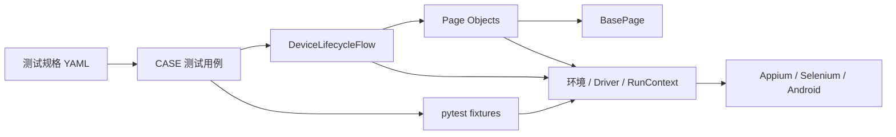

# Python 代码调用关系图

> 本文档由 `.agents/skills/code-callgraph/scripts/generate_callgraph.py` 基于 Python AST 生成。
> 图中只包含可静态解析的项目内部调用和 pytest fixture 注入；动态反射、字符串调用及第三方库内部调用不在图中。

## 项目分层总览

## CASE00 调用图

```mermaid
flowchart TD
    nc8c9a7214b["CASE00<br/>test_case00_enter_device_details_and_view_information()"]
    ndfc47c5362["_log_tail()"]
    n642bbe7fa5["_resolve_appium_command()"]
    n15f2a57bf5["_server_is_ready()"]
    n35e95e4ac5["_stop_process()"]
    n41acecdda5["fixture<br/>appium_server_url()"]
    nb40f747321["fixture<br/>driver()"]
    n88acc3da65["fixture<br/>environment()"]
    n9e4cda08cf["fixture<br/>run_context()"]
    nf188c3dd1a["create_android_driver()"]
    n0028de1ebe["_merge()"]
    n9d3343ae95["_read_yaml()"]
    nce24bff7ef["_required()"]
    n775f45e09e["load_environment()"]
    n7be11158d6["RunContext._save_failure()"]
    n9da65318db["RunContext.create()"]
    n1f2a03d290["RunContext.save_evidence()"]
    ncce215c57f["RunContext.step()"]
    n3c2c78bf99["DeviceLifecycleFlow.__init__()"]
    n9f67e9c229["DeviceLifecycleFlow.activate_and_return_home()"]
    ne902baa514["DeviceLifecycleFlow.open_device_details()"]
    n3758f668c8["BasePage.__init__()"]
    n9d6c662586["BasePage.back()"]
    n2782ff87e5["BasePage.find_texts()"]
    n6bd51eb778["BasePage.text_selector()"]
    n001f32db6f["BasePage.wait_for_text()"]
    nd3182dead1["DevicePanelPage.assert_details()"]
    nfd37ff7ace["DevicePanelPage.open_settings()"]
    nff025f2dce["DeviceSettingsPage.assert_loaded()"]
    n3dfa8d3dcb["HomePage.find_device()"]
    n42d8b59b31["HomePage.return_to_home()"]
    naa35a42260["HomePage.select_common_devices()"]
    nc8c9a7214b -->|fixture| nb40f747321
    nc8c9a7214b -->|fixture| n88acc3da65
    nc8c9a7214b -->|fixture| n9e4cda08cf
    nc8c9a7214b --> n1f2a03d290
    nc8c9a7214b --> ncce215c57f
    nc8c9a7214b --> n3c2c78bf99
    nc8c9a7214b --> n9f67e9c229
    nc8c9a7214b --> ne902baa514
    nc8c9a7214b --> n9d6c662586
    nc8c9a7214b --> nd3182dead1
    nc8c9a7214b --> nfd37ff7ace
    nc8c9a7214b --> nff025f2dce
    nc8c9a7214b --> n3dfa8d3dcb
    n41acecdda5 --> ndfc47c5362
    n41acecdda5 --> n642bbe7fa5
    n41acecdda5 --> n15f2a57bf5
    n41acecdda5 --> n35e95e4ac5
    nb40f747321 -->|fixture| n41acecdda5
    nb40f747321 -->|fixture| n88acc3da65
    nb40f747321 --> nf188c3dd1a
    n88acc3da65 --> n775f45e09e
    n9e4cda08cf --> n9da65318db
    n775f45e09e --> n0028de1ebe
    n775f45e09e --> n9d3343ae95
    n775f45e09e --> nce24bff7ef
    n7be11158d6 --> n1f2a03d290
    ncce215c57f --> n7be11158d6
    n3c2c78bf99 --> n3758f668c8
    n9f67e9c229 --> n42d8b59b31
    ne902baa514 --> nd3182dead1
    ne902baa514 --> n3dfa8d3dcb
    n2782ff87e5 --> n6bd51eb778
    n001f32db6f --> n6bd51eb778
    nd3182dead1 --> n001f32db6f
    nff025f2dce --> n001f32db6f
    n3dfa8d3dcb --> naa35a42260
    naa35a42260 --> n2782ff87e5
```

## CASE01 调用图

```mermaid
flowchart TD
    n26094f855f["CASE01<br/>test_case01_remove_device_successfully()"]
    ndfc47c5362["_log_tail()"]
    n642bbe7fa5["_resolve_appium_command()"]
    n15f2a57bf5["_server_is_ready()"]
    n35e95e4ac5["_stop_process()"]
    n41acecdda5["fixture<br/>appium_server_url()"]
    nb40f747321["fixture<br/>driver()"]
    n88acc3da65["fixture<br/>environment()"]
    n9e4cda08cf["fixture<br/>run_context()"]
    nf188c3dd1a["create_android_driver()"]
    n0028de1ebe["_merge()"]
    n9d3343ae95["_read_yaml()"]
    nce24bff7ef["_required()"]
    n775f45e09e["load_environment()"]
    n7be11158d6["RunContext._save_failure()"]
    n9da65318db["RunContext.create()"]
    n1f2a03d290["RunContext.save_evidence()"]
    ncce215c57f["RunContext.step()"]
    n3c2c78bf99["DeviceLifecycleFlow.__init__()"]
    n9f67e9c229["DeviceLifecycleFlow.activate_and_return_home()"]
    ne902baa514["DeviceLifecycleFlow.open_device_details()"]
    n87b3d19877["DeviceLifecycleFlow.open_device_settings()"]
    n8ee8759231["DeviceLifecycleFlow.unbind_device()"]
    n3758f668c8["BasePage.__init__()"]
    n2782ff87e5["BasePage.find_texts()"]
    n6bd51eb778["BasePage.text_selector()"]
    n001f32db6f["BasePage.wait_for_text()"]
    nd3182dead1["DevicePanelPage.assert_details()"]
    nfd37ff7ace["DevicePanelPage.open_settings()"]
    nff025f2dce["DeviceSettingsPage.assert_loaded()"]
    nad9c75e98d["DeviceSettingsPage.unbind()"]
    n68daa3064d["DeviceSettingsPage.wait_until_home()"]
    n880a354a8d["HomePage.assert_device_absent()"]
    n3dfa8d3dcb["HomePage.find_device()"]
    n42d8b59b31["HomePage.return_to_home()"]
    naa35a42260["HomePage.select_common_devices()"]
    n26094f855f -->|fixture| nb40f747321
    n26094f855f -->|fixture| n88acc3da65
    n26094f855f -->|fixture| n9e4cda08cf
    n26094f855f --> n1f2a03d290
    n26094f855f --> ncce215c57f
    n26094f855f --> n3c2c78bf99
    n26094f855f --> n9f67e9c229
    n26094f855f --> n8ee8759231
    n41acecdda5 --> ndfc47c5362
    n41acecdda5 --> n642bbe7fa5
    n41acecdda5 --> n15f2a57bf5
    n41acecdda5 --> n35e95e4ac5
    nb40f747321 -->|fixture| n41acecdda5
    nb40f747321 -->|fixture| n88acc3da65
    nb40f747321 --> nf188c3dd1a
    n88acc3da65 --> n775f45e09e
    n9e4cda08cf --> n9da65318db
    n775f45e09e --> n0028de1ebe
    n775f45e09e --> n9d3343ae95
    n775f45e09e --> nce24bff7ef
    n7be11158d6 --> n1f2a03d290
    ncce215c57f --> n7be11158d6
    n3c2c78bf99 --> n3758f668c8
    n9f67e9c229 --> n42d8b59b31
    ne902baa514 --> nd3182dead1
    ne902baa514 --> n3dfa8d3dcb
    n87b3d19877 --> ne902baa514
    n87b3d19877 --> nfd37ff7ace
    n87b3d19877 --> nff025f2dce
    n8ee8759231 --> n87b3d19877
    n8ee8759231 --> nad9c75e98d
    n8ee8759231 --> n68daa3064d
    n8ee8759231 --> n880a354a8d
    n2782ff87e5 --> n6bd51eb778
    n001f32db6f --> n6bd51eb778
    nd3182dead1 --> n001f32db6f
    nff025f2dce --> n001f32db6f
    nad9c75e98d --> n001f32db6f
    n880a354a8d --> naa35a42260
    n3dfa8d3dcb --> naa35a42260
    naa35a42260 --> n2782ff87e5
```

## CASE02 调用图

```mermaid
flowchart TD
    n20f7559175["CASE02<br/>test_case02_remove_and_repair_device_successfully()"]
    ndfc47c5362["_log_tail()"]
    n642bbe7fa5["_resolve_appium_command()"]
    n15f2a57bf5["_server_is_ready()"]
    n35e95e4ac5["_stop_process()"]
    n41acecdda5["fixture<br/>appium_server_url()"]
    nb40f747321["fixture<br/>driver()"]
    n88acc3da65["fixture<br/>environment()"]
    n9e4cda08cf["fixture<br/>run_context()"]
    nf188c3dd1a["create_android_driver()"]
    n0028de1ebe["_merge()"]
    n9d3343ae95["_read_yaml()"]
    nce24bff7ef["_required()"]
    n775f45e09e["load_environment()"]
    n7be11158d6["RunContext._save_failure()"]
    n9da65318db["RunContext.create()"]
    n1f2a03d290["RunContext.save_evidence()"]
    ncce215c57f["RunContext.step()"]
    n3c2c78bf99["DeviceLifecycleFlow.__init__()"]
    n9f67e9c229["DeviceLifecycleFlow.activate_and_return_home()"]
    n9f87138c6f["DeviceLifecycleFlow.open_add_device()"]
    ne902baa514["DeviceLifecycleFlow.open_device_details()"]
    n87b3d19877["DeviceLifecycleFlow.open_device_settings()"]
    n324b184102["DeviceLifecycleFlow.submit_default_wifi()"]
    n8ee8759231["DeviceLifecycleFlow.unbind_device()"]
    n57d51b306c["DeviceLifecycleFlow.wait_for_pairing_success()"]
    n24e521aa42["AddDevicePage.continue_from_detected_device()"]
    n6123a3eb38["AddDevicePage.submit_default_wifi()"]
    n0e30d019ab["AddDevicePage.wait_for_pairing_success()"]
    n9605afa387["AddDevicePage.wait_until_loaded()"]
    n3758f668c8["BasePage.__init__()"]
    n2782ff87e5["BasePage.find_texts()"]
    na54ddc0d3f["BasePage.resource_id()"]
    n6bd51eb778["BasePage.text_selector()"]
    n001f32db6f["BasePage.wait_for_text()"]
    nd3182dead1["DevicePanelPage.assert_details()"]
    nfd37ff7ace["DevicePanelPage.open_settings()"]
    nff025f2dce["DeviceSettingsPage.assert_loaded()"]
    nad9c75e98d["DeviceSettingsPage.unbind()"]
    n68daa3064d["DeviceSettingsPage.wait_until_home()"]
    n880a354a8d["HomePage.assert_device_absent()"]
    n3dfa8d3dcb["HomePage.find_device()"]
    n55ae38685f["HomePage.open_add_device_page()"]
    n42d8b59b31["HomePage.return_to_home()"]
    naa35a42260["HomePage.select_common_devices()"]
    n20f7559175 -->|fixture| nb40f747321
    n20f7559175 -->|fixture| n88acc3da65
    n20f7559175 -->|fixture| n9e4cda08cf
    n20f7559175 --> n1f2a03d290
    n20f7559175 --> ncce215c57f
    n20f7559175 --> n3c2c78bf99
    n20f7559175 --> n9f67e9c229
    n20f7559175 --> n9f87138c6f
    n20f7559175 --> n324b184102
    n20f7559175 --> n8ee8759231
    n20f7559175 --> n57d51b306c
    n41acecdda5 --> ndfc47c5362
    n41acecdda5 --> n642bbe7fa5
    n41acecdda5 --> n15f2a57bf5
    n41acecdda5 --> n35e95e4ac5
    nb40f747321 -->|fixture| n41acecdda5
    nb40f747321 -->|fixture| n88acc3da65
    nb40f747321 --> nf188c3dd1a
    n88acc3da65 --> n775f45e09e
    n9e4cda08cf --> n9da65318db
    n775f45e09e --> n0028de1ebe
    n775f45e09e --> n9d3343ae95
    n775f45e09e --> nce24bff7ef
    n7be11158d6 --> n1f2a03d290
    ncce215c57f --> n7be11158d6
    n3c2c78bf99 --> n3758f668c8
    n9f67e9c229 --> n42d8b59b31
    n9f87138c6f --> n9605afa387
    n9f87138c6f --> n55ae38685f
    ne902baa514 --> nd3182dead1
    ne902baa514 --> n3dfa8d3dcb
    n87b3d19877 --> ne902baa514
    n87b3d19877 --> nfd37ff7ace
    n87b3d19877 --> nff025f2dce
    n324b184102 --> n24e521aa42
    n324b184102 --> n6123a3eb38
    n8ee8759231 --> n87b3d19877
    n8ee8759231 --> nad9c75e98d
    n8ee8759231 --> n68daa3064d
    n8ee8759231 --> n880a354a8d
    n57d51b306c --> n0e30d019ab
    n57d51b306c --> nd3182dead1
    n24e521aa42 --> n6bd51eb778
    n24e521aa42 --> n001f32db6f
    n6123a3eb38 --> na54ddc0d3f
    n0e30d019ab --> na54ddc0d3f
    n0e30d019ab --> n001f32db6f
    n9605afa387 --> n001f32db6f
    n2782ff87e5 --> n6bd51eb778
    n001f32db6f --> n6bd51eb778
    nd3182dead1 --> n001f32db6f
    nff025f2dce --> n001f32db6f
    nad9c75e98d --> n001f32db6f
    n880a354a8d --> naa35a42260
    n3dfa8d3dcb --> naa35a42260
    n55ae38685f --> na54ddc0d3f
    naa35a42260 --> n2782ff87e5
```

## CASE 直接共享调用

```mermaid
flowchart TD
    nc8c9a7214b["CASE00<br/>test_case00_enter_device_details_and_view_information()"]
    n26094f855f["CASE01<br/>test_case01_remove_device_successfully()"]
    n20f7559175["CASE02<br/>test_case02_remove_and_repair_device_successfully()"]
    nb40f747321["fixture<br/>driver()"]
    n88acc3da65["fixture<br/>environment()"]
    n9e4cda08cf["fixture<br/>run_context()"]
    n1f2a03d290["RunContext.save_evidence()"]
    ncce215c57f["RunContext.step()"]
    n3c2c78bf99["DeviceLifecycleFlow.__init__()"]
    n9f67e9c229["DeviceLifecycleFlow.activate_and_return_home()"]
    n8ee8759231["DeviceLifecycleFlow.unbind_device()"]
    nc8c9a7214b -->|fixture| nb40f747321
    nc8c9a7214b -->|fixture| n88acc3da65
    nc8c9a7214b -->|fixture| n9e4cda08cf
    nc8c9a7214b --> n1f2a03d290
    nc8c9a7214b --> ncce215c57f
    nc8c9a7214b --> n3c2c78bf99
    nc8c9a7214b --> n9f67e9c229
    n26094f855f -->|fixture| nb40f747321
    n26094f855f -->|fixture| n88acc3da65
    n26094f855f -->|fixture| n9e4cda08cf
    n26094f855f --> n1f2a03d290
    n26094f855f --> ncce215c57f
    n26094f855f --> n3c2c78bf99
    n26094f855f --> n9f67e9c229
    n26094f855f --> n8ee8759231
    n20f7559175 -->|fixture| nb40f747321
    n20f7559175 -->|fixture| n88acc3da65
    n20f7559175 -->|fixture| n9e4cda08cf
    n20f7559175 --> n1f2a03d290
    n20f7559175 --> ncce215c57f
    n20f7559175 --> n3c2c78bf99
    n20f7559175 --> n9f67e9c229
    n20f7559175 --> n8ee8759231
```

## 函数索引

| 层级 | 函数或方法 | 定义位置 | 项目内调用者数 | 项目内调用数 |
| --- | --- | --- | ---: | ---: |
| Core | `create_android_driver()` | `appium_auto/core/driver_factory.py:7` | 1 | 0 |
| Core | `WifiConfig.__repr__()` | `appium_auto/core/environment.py:44` | 0 | 0 |
| Core | `_read_yaml()` | `appium_auto/core/environment.py:56` | 2 | 0 |
| Core | `_merge()` | `appium_auto/core/environment.py:68` | 1 | 0 |
| Core | `_required()` | `appium_auto/core/environment.py:78` | 2 | 0 |
| Core | `load_wifi_config()` | `appium_auto/core/environment.py:85` | 2 | 2 |
| Core | `load_environment()` | `appium_auto/core/environment.py:97` | 5 | 3 |
| Core | `RunContext.create()` | `appium_auto/core/run_context.py:18` | 2 | 0 |
| Core | `RunContext.save_evidence()` | `appium_auto/core/run_context.py:32` | 4 | 0 |
| Core | `RunContext._save_failure()` | `appium_auto/core/run_context.py:38` | 1 | 1 |
| Core | `RunContext.step()` | `appium_auto/core/run_context.py:73` | 3 | 1 |
| Fixture | `_server_is_ready()` | `appium_auto/conftest.py:21` | 1 | 0 |
| Fixture | `_resolve_appium_command()` | `appium_auto/conftest.py:30` | 1 | 0 |
| Fixture | `_stop_process()` | `appium_auto/conftest.py:47` | 1 | 0 |
| Fixture | `_log_tail()` | `appium_auto/conftest.py:58` | 1 | 0 |
| Fixture | `appium_server_url()` | `appium_auto/conftest.py:66` | 1 | 4 |
| Fixture | `environment()` | `appium_auto/conftest.py:130` | 4 | 1 |
| Fixture | `driver()` | `appium_auto/conftest.py:135` | 3 | 3 |
| Fixture | `run_context()` | `appium_auto/conftest.py:142` | 3 | 1 |
| Flow | `DeviceLifecycleFlow.__init__()` | `appium_auto/flows/device_lifecycle.py:14` | 3 | 1 |
| Flow | `DeviceLifecycleFlow.activate_and_return_home()` | `appium_auto/flows/device_lifecycle.py:24` | 3 | 1 |
| Flow | `DeviceLifecycleFlow.open_device_details()` | `appium_auto/flows/device_lifecycle.py:31` | 2 | 2 |
| Flow | `DeviceLifecycleFlow.open_device_settings()` | `appium_auto/flows/device_lifecycle.py:35` | 1 | 3 |
| Flow | `DeviceLifecycleFlow.unbind_device()` | `appium_auto/flows/device_lifecycle.py:40` | 2 | 4 |
| Flow | `DeviceLifecycleFlow.open_add_device()` | `appium_auto/flows/device_lifecycle.py:46` | 1 | 2 |
| Flow | `DeviceLifecycleFlow.submit_default_wifi()` | `appium_auto/flows/device_lifecycle.py:50` | 1 | 2 |
| Flow | `DeviceLifecycleFlow.wait_for_pairing_success()` | `appium_auto/flows/device_lifecycle.py:54` | 1 | 2 |
| Page | `AddDevicePage.wait_until_loaded()` | `appium_auto/pages/add_device_page.py:12` | 1 | 1 |
| Page | `AddDevicePage.continue_from_detected_device()` | `appium_auto/pages/add_device_page.py:15` | 1 | 2 |
| Page | `AddDevicePage.submit_default_wifi()` | `appium_auto/pages/add_device_page.py:38` | 1 | 1 |
| Page | `AddDevicePage.wait_for_pairing_success()` | `appium_auto/pages/add_device_page.py:48` | 2 | 2 |
| Page | `BasePage.__init__()` | `appium_auto/pages/base_page.py:9` | 6 | 0 |
| Page | `BasePage.resource_id()` | `appium_auto/pages/base_page.py:15` | 7 | 0 |
| Page | `BasePage.text_selector()` | `appium_auto/pages/base_page.py:19` | 3 | 0 |
| Page | `BasePage.wait_for_text()` | `appium_auto/pages/base_page.py:22` | 6 | 1 |
| Page | `BasePage.find_texts()` | `appium_auto/pages/base_page.py:29` | 1 | 1 |
| Page | `BasePage.back()` | `appium_auto/pages/base_page.py:34` | 1 | 0 |
| Page | `DevicePanelPage.assert_details()` | `appium_auto/pages/device_panel_page.py:13` | 3 | 1 |
| Page | `DevicePanelPage.open_settings()` | `appium_auto/pages/device_panel_page.py:18` | 2 | 0 |
| Page | `DeviceSettingsPage.assert_loaded()` | `appium_auto/pages/device_settings_page.py:8` | 2 | 1 |
| Page | `DeviceSettingsPage.unbind()` | `appium_auto/pages/device_settings_page.py:11` | 1 | 1 |
| Page | `DeviceSettingsPage.wait_until_home()` | `appium_auto/pages/device_settings_page.py:19` | 1 | 0 |
| Page | `HomePage.home_menu_xpath()` | `appium_auto/pages/home_page.py:10` | 0 | 1 |
| Page | `HomePage.home_tab_selector()` | `appium_auto/pages/home_page.py:17` | 0 | 1 |
| Page | `HomePage.device_selector()` | `appium_auto/pages/home_page.py:24` | 0 | 1 |
| Page | `HomePage.scroll_to_device_selector()` | `appium_auto/pages/home_page.py:32` | 0 | 1 |
| Page | `HomePage.wait_until_loaded()` | `appium_auto/pages/home_page.py:42` | 0 | 0 |
| Page | `HomePage.return_to_home()` | `appium_auto/pages/home_page.py:49` | 1 | 0 |
| Page | `HomePage.select_common_devices()` | `appium_auto/pages/home_page.py:66` | 2 | 1 |
| Page | `HomePage.find_device()` | `appium_auto/pages/home_page.py:71` | 2 | 1 |
| Page | `HomePage.assert_device_absent()` | `appium_auto/pages/home_page.py:87` | 3 | 1 |
| Page | `HomePage.open_add_device_page()` | `appium_auto/pages/home_page.py:108` | 2 | 1 |
| 单元测试 | `test_pairing_success_strictly_waits_for_adding_before_success()` | `tests/unit/test_add_device_page.py:7` | 0 | 3 |
| 单元测试 | `_flow_without_driver_initialization()` | `tests/unit/test_device_lifecycle.py:6` | 2 | 0 |
| 单元测试 | `test_unbind_device_reuses_page_objects()` | `tests/unit/test_device_lifecycle.py:15` | 0 | 1 |
| 单元测试 | `test_pairing_flow_keeps_adding_assertion_before_completion()` | `tests/unit/test_device_lifecycle.py:29` | 0 | 1 |
| 单元测试 | `_write()` | `tests/unit/test_environment.py:8` | 5 | 0 |
| 单元测试 | `test_local_config_overrides_default()` | `tests/unit/test_environment.py:13` | 0 | 2 |
| 单元测试 | `test_udid_environment_variable_has_highest_priority()` | `tests/unit/test_environment.py:29` | 0 | 2 |
| 单元测试 | `test_required_environment_field_reports_actionable_error()` | `tests/unit/test_environment.py:39` | 0 | 2 |
| 单元测试 | `test_wifi_config_is_optional()` | `tests/unit/test_environment.py:48` | 0 | 1 |
| 单元测试 | `test_wifi_config_repr_hides_password()` | `tests/unit/test_environment.py:55` | 0 | 2 |
| 单元测试 | `test_environment_does_not_load_wifi_before_case03()` | `tests/unit/test_environment.py:69` | 0 | 2 |
| 单元测试 | `_environment()` | `tests/unit/test_home_page.py:15` | 5 | 0 |
| 单元测试 | `test_home_locators_come_from_environment()` | `tests/unit/test_home_page.py:27` | 0 | 2 |
| 单元测试 | `test_open_add_device_always_restores_multiwindow_setting()` | `tests/unit/test_home_page.py:35` | 0 | 3 |
| 单元测试 | `test_assert_device_absent_accepts_full_list_search_without_target()` | `tests/unit/test_home_page.py:52` | 0 | 3 |
| 单元测试 | `test_assert_device_absent_rejects_visible_target()` | `tests/unit/test_home_page.py:61` | 0 | 3 |
| 单元测试 | `test_sensitive_step_does_not_save_screenshot_or_page_source()` | `tests/unit/test_run_context.py:8` | 0 | 1 |
| 用例 | `test_case00_enter_device_details_and_view_information()` | `appium_auto/cases/test_case00_device_details.py:9` | 0 | 13 |
| 用例 | `test_case01_remove_device_successfully()` | `appium_auto/cases/test_case01_remove_device.py:16` | 0 | 8 |
| 用例 | `test_case02_remove_and_repair_device_successfully()` | `appium_auto/cases/test_case02_remove_and_repair_device.py:16` | 0 | 11 |
